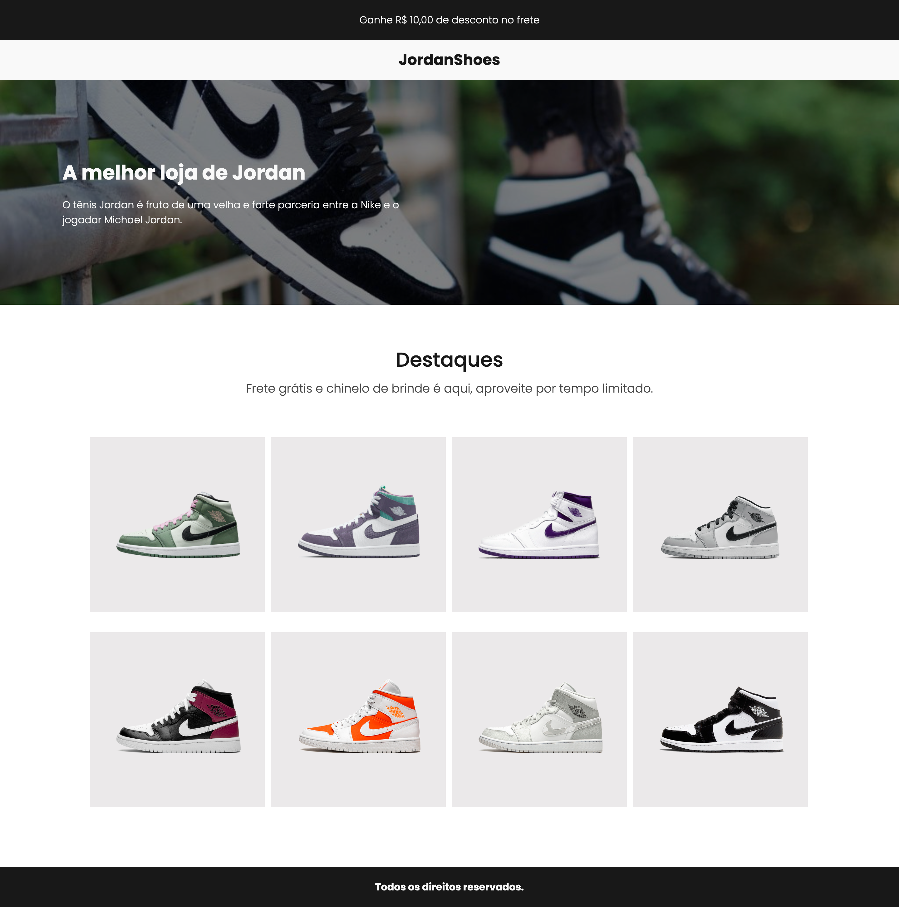

## 🚀 Sobre o Projeto
A ideia do projeto foi para aplicar, práticar e melhorar minhas habilidades técnicas em desenvolvimento web com React e mais tecnologias que envolvendo a concepção, desenvolvimento e entrega do produto.

## 💡 Ideia
O projeto tem o objetivo final de ser um ecommerce com design responsivo.

## 🚀 Live Preview
Acesse o projeto: [Live Preview](https://jordanshoes-ecommerce.vercel.app/)

## 🚀 Novas versões
Conforme vou adquirindo novas habilidades, irei atualizando o projeto em novas versões. 

## 🚀 Tecnologias utilizadas
- HTML/CSS
- Javascript
- React
- NPM / NPX
- React Router DOM
- Phosphor Icons
- Vercel

##

